# tedx-feb-2026-why-do-what-the-machine-can-do
TedX Feb 13th, 2026  Why it's important to still do what the machine can do.

Full Draft talk [here](https://hpssjellis.github.io/tedx-feb-2026-educational-duality/public/index.html)

# 1 Why it's important to still do what the machine can do. 
**Who’s Awake When the Machine Is Wrong? Automation is impressive; oversight is essential.**

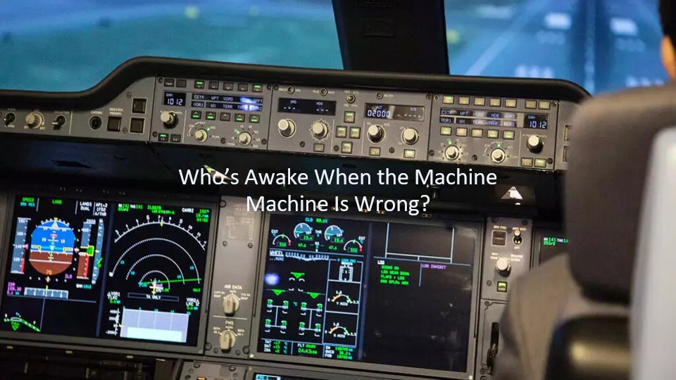

---

## 2 Someone Still Has to Know How to Fly.
**Would you trust a pilot who’s never seen a cockpit?**

Let me start with a simple question:  
Would you board a fully automated plane if no one on board knew how to fly?

Not as a backup.  Not in an emergency.  Not even to notice when something feels wrong.

That is the moment we are living in with AI.

The systems are powerful. The automation is impressive. But safety still depends on whether a human can recognize when the machine is drifting off course. Education is not about resisting technology. It is about ensuring someone is awake in the cockpit.

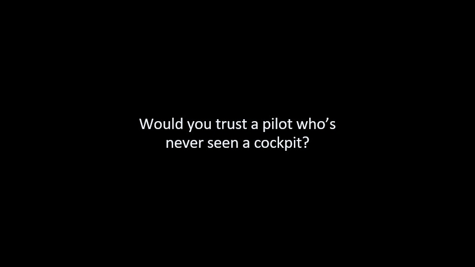

---

## 3 Why I’m Saying This Now.
**Teaching coding stopped following a bell curve.**

I’ve been teaching coding for 35 years. For the first 20, learning followed a familiar pattern. Most students struggled at first, then gradually improved. A few were fast, a few were slow, but nearly everyone could eventually use core ideas.

Then something changed.

About 10 years ago two coding foundational concepts "if statements" and "arrays" became teachable to only about half the class. Not harder to teach but polarized. Some students grasped the concepts in minutes and used them creatively. Others could work on examples for weeks and still could not apply them independently.

There was no bell curve anymore. Just two groups.

I blamed screen time. I was wrong. It is more complex thatn just screen time. Students with strong foundational skills learned quickly regardless of screen time. Students without those foundations stalled, no matter how much instruction they received.

What I was seeing was not distraction. It was missing cognitive scaffolding.

That was 10 years ago, now, with large language models, this split is widening. Students with foundations use AI to think faster and deeper. Students without them use AI to complete assignments without any understanding.

The gap is no longer between fast and slow learners. It is between "learners" and "assignment finishers". And that gap is growing.

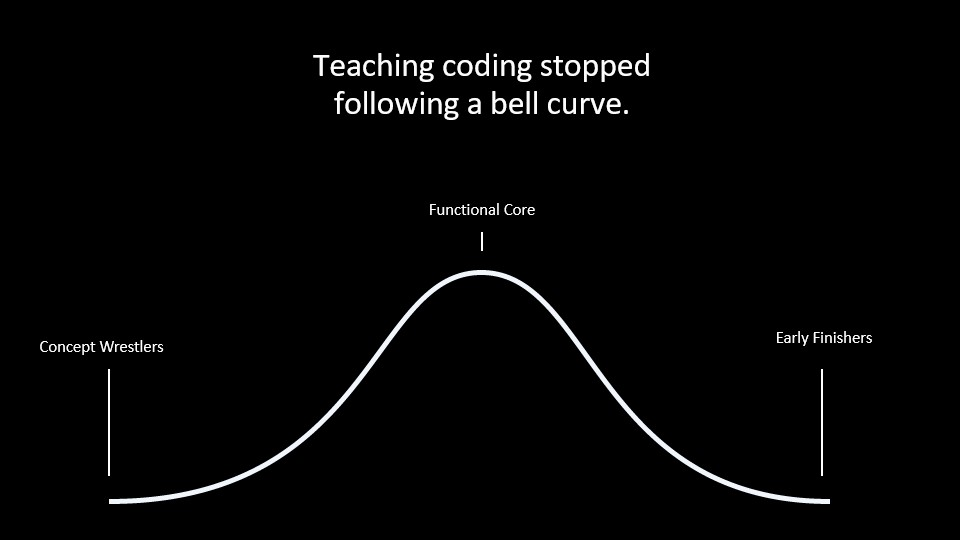
---

## 4 The Risk We Avoid Naming.
**When effort disappears, learning atrophies.**

If we stop practicing basic operations, such as: calculation, estimation, logic, persistence, we don’t just forget techniques. We lose internal reference points.

Those reference points are what tell us, "Something is wrong here."

Convenience feels like progress, but it has a cost. This is not about working harder for its own sake. It is about staying in control when the machine is confident and wrong.

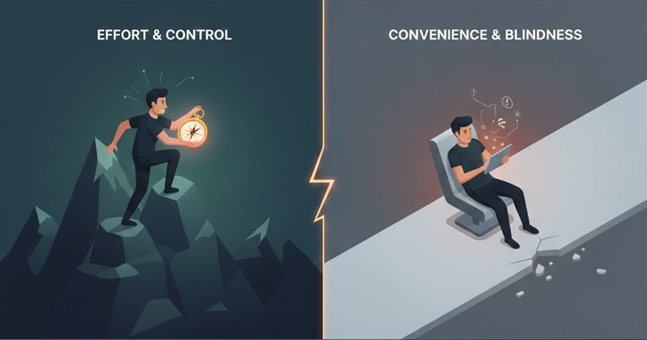

---

## 5 Our Internal Quality Control.
**Critical thinking is not a mindset. It is neural circuitry.**

This is not a metaphor. It is neuroscience.

The Added Problem:

Banning phones can help students focus, but it doesn’t teach them how to manage distraction. Students need internal motivation and self-control whether a phone is present or not. The real task is helping them use phones to support learning, rather than letting phones shape how they think.

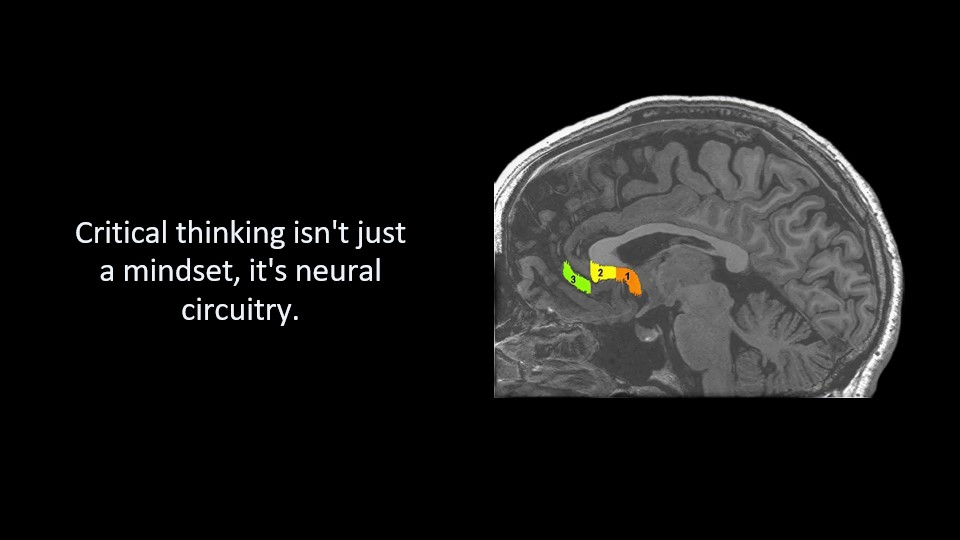

---

## 6 The Brain’s Error Signal.
**The ACC: your biological alarm bell.**

The anterior cingulate cortex (ACC) activates when an answer conflicts with expectations. It does not shout. It whispers. It produces doubt, the feeling that something doesn’t quite fit.

That signal only develops if we regularly do the work ourselves. No effort, no alarm.

[Carter et al., 1998](https://doi.org/10.1126/science.280.5364.747)

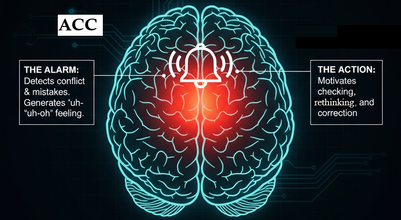

---

## 7 The Brain’s Persistence Engine.
**The aMCC: effort, grit, and follow-through.**

The anterior mid-cingulate cortex (aMCC) is associated with sustained effort, will power and persistence. It strengthens when we do difficult things we would rather avoid. It weakens when we consistently choose the easiest path.

When students rely on frictionless answers instead of effortful thinking, these systems are not engaged. Convenience doesn’t just change behavior. It changes the brain.

[Touroutoglou et al., 2020](https://doi.org/10.1016/j.cortex.2019.09.011)

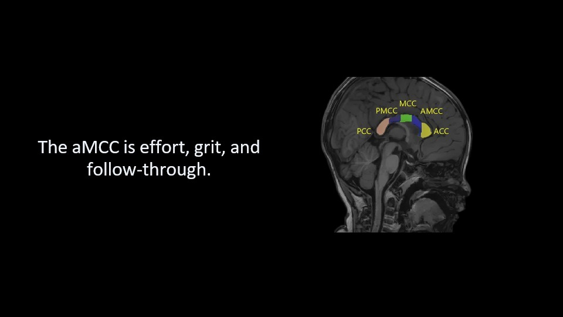

---

## 8 Fluent Does Not Mean True.
**AI generates probabilities, not facts.**

AI systems do not check truth. They generate likely sequences of words.

In 2023, a lawyer submitted a legal brief generated by AI. It cited six court cases. Every one of them was fabricated. Convincing. Detailed. Entirely fictional.

A first-year law student would have caught it. The lawyer did not.
Why? No baseline. No internal alarm. No correction.

[Mata v. Avianca, Inc., 2023](https://www.law.berkeley.edu/wp-content/uploads/2025/12/Mata-v-Avianca-Inc.pdf)

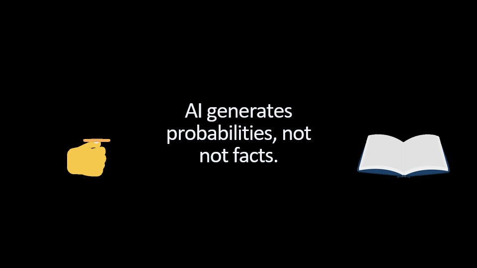

---

## 9 This Pattern Is Not New.
**We didn’t just lose arithmetic. We lost number sense.**

In the 1980s, calculators freed us for high-level math. That part worked, but we paid a price: we lost the "gut feeling" for estimation and magnitude, the internal alarm that says, “That answer can’t be right.”

The Flynn Effect shows this same divergence at scale. While teenagers gained "game-like" visual problem-solving, our foundational reasoning skills have stalled or reversed. We are trading deep cognitive intuition for surface-level speed.

AI is accelerating this trade-off. It doesn't just affect math; it targets language, logic, and judgment, the very systems our internal "pilot" needs to stay alert.

[Bratsberg & Rogeberg, 2018](https://www.pnas.org/doi/10.1073/pnas.1718793115)

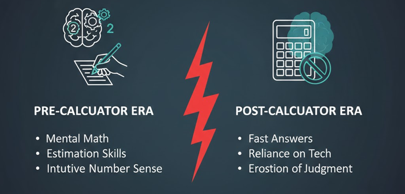

---

## 10 Technology Widens the Gap.
**AI amplifies foundations; it does not create them.**

Some students thrive with AI. They build faster and explore deeper. They share one trait: strong foundations.

AI does not create ability. It amplifies it.

The danger is not replacement. The danger is divergence, a widening gap driven by missing fundamentals.

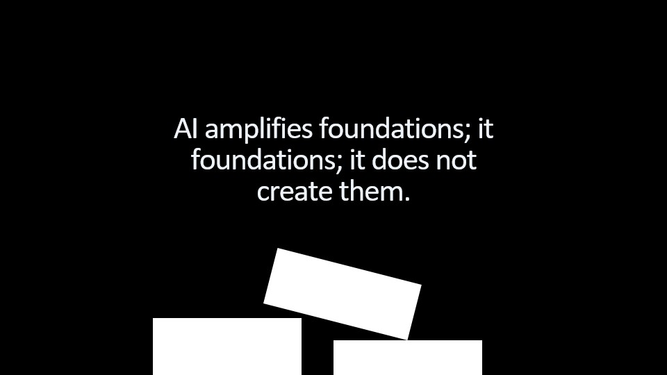

---

## 11 The New Core Skills.
**We practice what the machine does so we can detect failure.**

Reasoning and persistence allow students to detect contradictions.  
Context and empathy reveal when a correct response is humanly wrong.  
Language precision exposes fluency without depth.  
Ethical judgment asks not just "Is this correct?" but “Is this responsible?”

We practice what the machine does so we know when it fails.

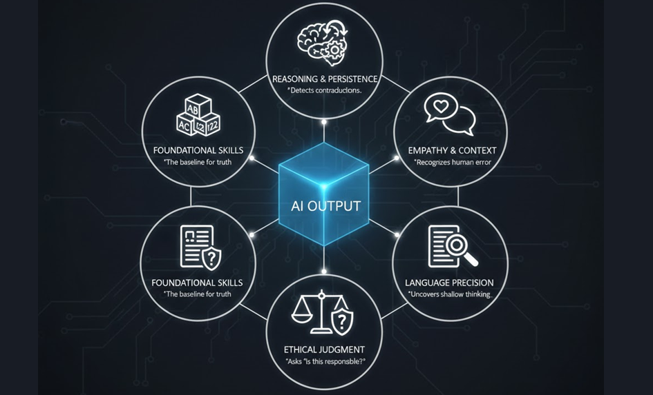

---

## 12 Three Concrete Interventions.
**From principle to practice.**

This is not abstract. These actions work.

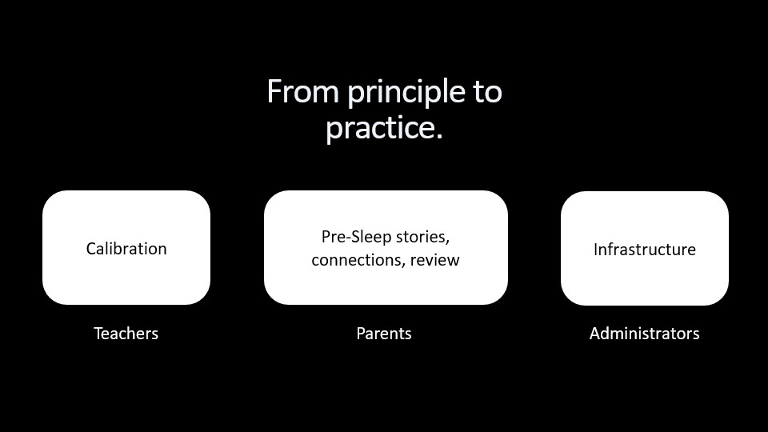

---

## 13 For Teachers: Friction Before Freedom.
**The LED / LEAD model.**

Teachers are welcome to try for short amounts of time:

**LED, Low-tech, Effort-Driven**  
Handwriting, math, estimation, retrieval practice.  
Goal: engage ACC and aMCC while foundations form.

**LEAD, High Level, Personal Persistence, Explore, And Discover**  
Extend, test, and build.  
Goal: amplify solid understanding, persoanl choice.

The ratio tells you everything:  
Too few reach LEAD → LED was too hard.  
Everyone reaches LEAD instantly → LED was too easy.

Effort is non-negotiable. Curiosity is rewarded.

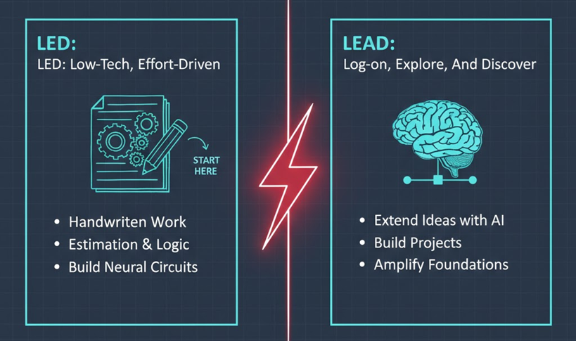

---

## 14 For Parents: Protect the Pre-Sleep Brain.
**What happens before sleep determines what sticks.**

Parents can do a home version of LED / LEAD but more important, before sleep, the brain enters hypnagogia, a critical window where it reviews sustained effort to consolidate learning. Too often, this window is lost to scrolling.

For elementary children: bedtime stories.  
For middle school students: conversation—what was confusing, what didn’t make sense, make a conncetion

For High School Students: Review the days lessons before sleep, this strengthens memory and intuition.

[Walker, M. P., & Stickgold, R. (2006)](https://walkerlab.berkeley.edu/reprints/Walker&Stickgold_AnnRevPsych_2006.pdf)

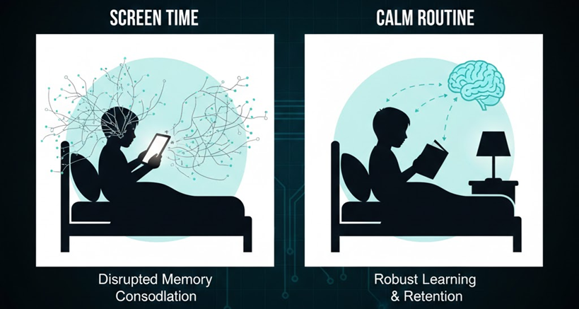

---

## 15 For Administrators: Make Skills a Shared Outcome.
**Auditing AI is a system-wide responsibility.**

When students struggle in Grade 10, we blame the Grade 10 Math and English teachers!

But the gap was built over years.

Implement a school-wide grade 10 skills audit, early and late in the year. Not subject-based. Skills-based.

Estimation.
Reading under pressure.
Reasoning.
Sustained problem-solving.

Every teacher owns a piece of the human pilot:

Elementary: The Foundation. Hard-wiring the basics. If you can’t do the mental math or read the sentence fluently, you have no "spare" brain power to question the AI.

Middle School: The "Gut" Feeling. Developing the internal alarm that goes off when an answer just looks wrong. It’s teaching kids to trust their instincts over the screen.

Math: Reality Checks. Using quick estimation to catch the machine’s mistakes. It’s about being "close enough" in your head to know the AI is way off.

English: Reading the Room. Finding the hidden meaning. AI can generate text, but it can’t understand intent, tone, or the "vibe" of a human conversation.

Science: Real-World Testing. If the AI’s logic doesn’t work in a physical experiment, the AI is wrong. Science is the bridge between the screen and the dirt.

Social Studies: Checking the Source. Asking "Who told you this and what do they want?" It’s about spotting bias before it becomes "truth."

Electives: Hands-on Mastery. Skills that require a body—cooking, building, playing an instrument. You can't "prompt" your way to physical excellence.

No blame. Shared ownership.

If we want students who can audit AI, we must measure and train that ability honestly.

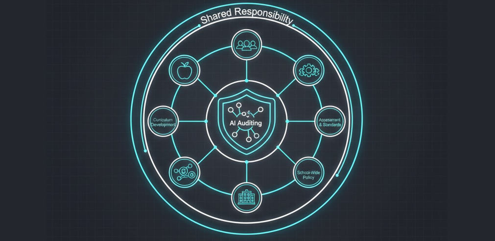

---

## 16 Conclusion: What the Future Requires.
**Not faster answers—better judgment.**

The future does not need people who can outpace machines. It needs people who can recognize when machines are wrong.

If students can calculate, they can question.  
If they can reason, they can verify.  
If they can persist, they can stay engaged when the system is confident and incorrect.

Education’s role is not to slow technology down, and never has been. It is to ensure humans are strong enough to stand beside AI.

Someone must always be thinking in the cockpit.

By Jeremy Ellis Twitter Linkedin jeremy-ellis-4237a9bb 
Github Profile: https://github.com/hpssjellis
Use this information at your own Risk!
